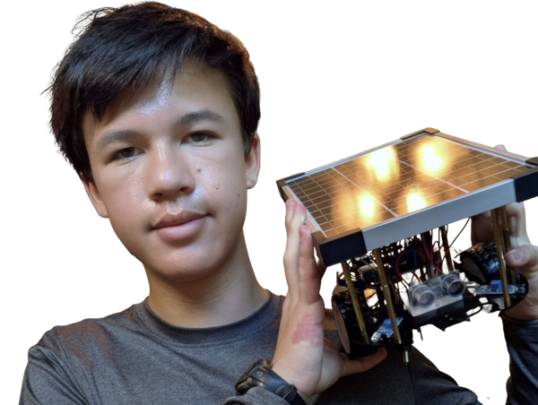

# Self-Driving Car
My project is a self-driving car. When it is powered on, it begins its trek, slowly moving forward until it reaches an obstacle, either veering off or reversing to avoid a collision. The base project is from the Sunfounder 3-in-1 kit mentioned in the bill of materials; it runs on an Arduino R3 Uno board, which runs on C++ and uses a 9V battery as its power source. I have modified the project to include both an IR remote to turn on/off it from a distance, and a solar panel so that it runs on solar power rather than batteries.

<!--Replace this text with a brief description (2-3 sentences) of your project. This description should draw the reader in and make them interested in what you've built. You can include what the biggest challenges, takeaways, and triumphs from completing the project were. As you complete your portfolio, remember your audience is less familiar than you are with all that your project entails!-->
<!--The biggest challenge I had was the wiring; this project had a decently compact wiring setup, which had some columns full of wires.-->


| **Engineer** | **School** | **Area of Interest** | **Grade** |
|:--:|:--:|:--:|:--:|
| Oliver H | Lynbrook Highschool | Electrical Engineering/Mechanical Engineering | Incoming Sophomore

<!--**Replace the BlueStamp logo below with an image of yourself and your completed project. Follow the guide [here](https://tomcam.github.io/least-github-pages/adding-images-github-pages-site.html) if you need help.**-->




# Final Milestone

<!--**Don't forget to replace the text below with the embedding for your milestone video. Go to Youtube, click Share -> Embed, and copy and paste the code to replace what's below.**-->

<iframe width="560" height="315" src="https://youtube.com/embed/mw8LapCJTlQ" title="YouTube video player" frameborder="0" allow="accelerometer; autoplay; clipboard-write; encrypted-media; gyroscope; picture-in-picture; web-share" allowfullscreen></iframe>
Since my last milestone, I have added an IR remote sensor, a solar panel, & a DC-DC step-down converter. At Bluestamps, I have learned  a lot about wiring, coding, and perseverance. I learned about perseverance when I pushed through in my coding, since I had trouble with fixing it so that it would not get stuck in easy situations. This took many attempts and a lot of time to fix. This showed me perseverance because I had to keep trying and trying to get it to work; if I had just stopped in the middle, then I wouldn't have overcome that obstacle, and it would never have been fixed. In the future, outside of bluestamps, I hope to develop my wiring skills further.

<!--For your final milestone, explain the outcome of your project. Key details to include are:
- What you've accomplished since your previous milestone
- What your biggest challenges and triumphs were at BSE
- A summary of key topics you learned about
- What you hope to learn in the future after everything you've learned at BSE-->


# First Milestone


<iframe width="560" height="315" src="https://www.youtube.com/embed/Gh5CL6sdwgA?si=XHWO7IYK0BkYQ-xn" title="YouTube video player" frameborder="0" allow="accelerometer; autoplay; clipboard-write; encrypted-media; gyroscope; picture-in-picture; web-share" referrerpolicy="strict-origin-when-cross-origin" allowfullscreen></iframe>
For my first milestone my project is in it's base form; it has 1 9V battery to power the entire project, 2 ir sensors for detecting objects, 1 ultrasound sensor for determining distance to nearest object, 1 arduino uno as its computer, 1 l9110 Module for controlling the motors, 2 TT motors to rotate the wheels, 2 TT wheels to apply the rotational power from the motor as translational power, and 1 universal wheel to support the project and keep it balanced. A challenge I faced was that the code would constantly get stuck whenever something was outside its sensors and obstructing it. I fixed this by adjusting the code and using the ultrasonic sensor to check whether the distance ahead remained the same for multiple seconds; if it didn't, it would back up and readjust itself.

<!-- This text is hidden and will not be displayed on the page -->
<!--For your first milestone, describe what your project is and how you plan to build it. You can include:-->
<!--- An explanation about the different components of your project and how they will all integrate together-->
<!--- Technical progress you've made so far-->
<!--- Challenges you're facing and solving in your future milestones-->
<!--- What your plan is to complete your project-->

<!--# Schematics -->
<!--Here's where you'll put images of your schematics. [Tinkercad](https://www.tinkercad.com/blog/official-guide-to-tinkercad-circuits) and [Fritzing](https://fritzing.org/learning/) are both great resoruces to create professional schematic diagrams, though BSE recommends Tinkercad becuase it can be done easily and for free in the browser. -->

# Code
```c++
#include <EEPROM.h>
#include <IRremote.h>

const float leftOffset = 0.91; //the offsets of the motors
const float rightOffset = 1.0;

const int A_1B = 5; //the pinholes for each motor and the function
const int A_1A = 6;
const int B_1B = 9;
const int B_1A = 10;

const int echoPin = 4;  //the pinholes for the ultrasound sensor
const int trigPin = 3;

const int rightIR = 7;  //the pinholes for the ir sensor
const int leftIR = 8;

const int IR_RECEIVE_PIN = 12;  //the pinhole for the irremote sensor

const float speedfactor = 0.60; //used to reduce the speed (mainly for power consumption)

int brtimes = 0;  //used to prevent the robot from being in a "stuck position" when it constantly moves itself out and back into the bad area
int bltimes = 0;

unsigned long lastBrAccess = 0; // Track last access time for brtimes
unsigned long lastBlAccess = 0; // Track last access time for bltimes

// --- Distance buffer and stuck detection variables ---
const int maxReadings = 100;
float distanceReadings[maxReadings];
int readingIndex = 0;
bool bufferFilled = false;
const float distanceTolerance = 1.0; // cm tolerance for mean stability

float previousMean = 0;
int stableMeanCount = 0;
const int stableMeanThreshold = 5;  // consecutive stable means before stuck action

float runningSum = 0;  // for efficient mean calculation

bool isOn = false;  //the var that turns on/off the system

float readSensorData() {
  digitalWrite(trigPin, LOW);
  delayMicroseconds(2);
  digitalWrite(trigPin, HIGH);
  delayMicroseconds(10);
  digitalWrite(trigPin, LOW);
  float distance = pulseIn(echoPin, HIGH) / 58.00; //Equivalent to (340m/s*1us)/2
  return distance;
}

void moveForward(int speed) {
  analogWrite(A_1B, 0);
  analogWrite(A_1A, (int)(speed*rightOffset));
  analogWrite(B_1B, (int)(speed*leftOffset));
  analogWrite(B_1A, 0);
}

void moveBackward(int speed) {
  analogWrite(A_1B, (int)(speed*rightOffset));
  analogWrite(A_1A, 0);
  analogWrite(B_1B, 0);
  analogWrite(B_1A, (int)(speed*leftOffset));
}

void backLeft(int speed) {
  unsigned long now = millis();
  if (now - lastBlAccess > 2300) { // reset after 2.3 seconds of inactivity
    bltimes = 0;
  }
  lastBlAccess = now;
  if (bltimes < 20) {
    analogWrite(A_1B, (int)(speed*rightOffset));
    analogWrite(A_1A, 0);
    analogWrite(B_1B, 0);
    analogWrite(B_1A, 0);
    bltimes++;
  } else {
    pivotLeft(speed);
    delay(500);
  }
}

void backRight(int speed) {
  unsigned long now = millis();
  if (now - lastBrAccess > 2300) { // reset after 2.3 seconds of inactivity
    brtimes = 0;
  }
  lastBrAccess = now;
  if (brtimes < 20) {
    analogWrite(A_1B, 0);
    analogWrite(A_1A, 0);
    analogWrite(B_1B, 0);
    analogWrite(B_1A, (int)(speed*leftOffset));
    brtimes++;
  } else {
    pivotRight(speed);
    delay(500);
  }
}

void stopMove() {
  analogWrite(A_1B, 0);
  analogWrite(A_1A, 0);
  analogWrite(B_1B, 0);
  analogWrite(B_1A, 0);
}

void pivotRight(int speed) {
  analogWrite(A_1B, 0);
  analogWrite(A_1A, (int)(speed*rightOffset));
  analogWrite(B_1B, 0);
  analogWrite(B_1A, (int)(speed*leftOffset));
}

void pivotLeft(int speed) {
  analogWrite(A_1B, (int)(speed*rightOffset));
  analogWrite(A_1A, 0);
  analogWrite(B_1B, (int)(speed*leftOffset));
  analogWrite(B_1A, 0);
}

String decodeKeyValue(long result)  //translates the received signal from the irremote sensor into its respective button
{
  switch(result){
    case 0x19:
      return "CYCLE";         
    case 0x45:
      return "POWER";   
    default :
      return "ERROR";
    }
}

// --- Distance buffer and stuck detection functions ---
void addDistanceReading(float newDistance) {
  runningSum -= distanceReadings[readingIndex];
  distanceReadings[readingIndex] = newDistance;
  runningSum += newDistance;
  readingIndex++;
  if (readingIndex >= maxReadings) {
    readingIndex = 0;
    bufferFilled = true;
  }
}

float calculateMean() {
  int count = bufferFilled ? maxReadings : readingIndex;
  if (count == 0) return 0;
  return runningSum / count;
}

void handleDistanceAndStuckDetection(float distance) {
  // Filter invalid readings
  if (distance > 2 && distance < 400) {
    addDistanceReading(distance);
  } else {
    stableMeanCount = 0;
    return;
  }
  if (!bufferFilled) {
    previousMean = calculateMean();
    return;
  }
  float currentMean = calculateMean();
  if (abs(currentMean - previousMean) <= distanceTolerance) {
    stableMeanCount++;
  } else {
    stableMeanCount = 0;
  }
  if (stableMeanCount >= stableMeanThreshold) {
    moveBackward(150 * speedfactor);
    delay(1000);
    pivotRight(150 * speedfactor);
    delay(300);

    stableMeanCount = 0;
    bufferFilled = false;
    readingIndex = 0;
    runningSum = 0;
  }
  previousMean = currentMean;
}

void setup() {
  Serial.begin(9600);
  //motor
  pinMode(A_1B, OUTPUT);
  pinMode(A_1A, OUTPUT);
  pinMode(B_1B, OUTPUT);
  pinMode(B_1A, OUTPUT);
  //ultrasonic
  pinMode(echoPin, INPUT);
  pinMode(trigPin, OUTPUT);
  //IR obstacle
  pinMode(leftIR, INPUT);
  pinMode(rightIR, INPUT);
  IrReceiver.begin(IR_RECEIVE_PIN, ENABLE_LED_FEEDBACK);
}

void loop() {
  int left = digitalRead(leftIR);  // 0: Obstructed   1: Empty
  int right = digitalRead(rightIR);
  if (isOn) {
    if (!left && right) {
      brtimes=0;
      backLeft(150*speedfactor);
    } else if (left && !right) {
      bltimes=0;
      backRight(150*speedfactor);
    } else if (!left && !right) {
      moveBackward(150*speedfactor);
    } else {
      float distance = readSensorData();
      Serial.println(distance);
      // Run stuck detection only if robot is moving forward (both IR sensors clear)
      bool isMovingForward = (left && right);
      if (isMovingForward) {
        handleDistanceAndStuckDetection(distance);
      } else {
        stableMeanCount = 0; // reset if not moving forward
      }
      // Normal obstacle avoidance logic
      if (distance < 10) { // Attention: object very close
        moveBackward(150*speedfactor);
        delay(1000);
        backLeft(150*speedfactor);
        delay(500);
      } else if (distance > 12) {
        moveForward(constrain(map(distance, 12, 50, 100, 150), 100, 150)*speedfactor);
      } else {
        pivotRight(150*speedfactor);
      }
    }
  } else {
    stopMove();
  }
  if (IrReceiver.decode()) {
    String key = decodeKeyValue(IrReceiver.decodedIRData.command);
    if (key != "ERROR") {
      Serial.println(key);
      if (key == "POWER") {
        isOn = !isOn;
        delay(100);
      } else if (key == "CYCLE") {
        moveBackward(150*speedfactor);
        delay(500);
        pivotLeft(150*speedfactor);
        delay(250);
      }
    }
    IrReceiver.resume();
  }
}

```


# Bill of Materials
<!--Here's where you'll list the parts in your project. To add more rows, just copy and paste the example rows below.
Don't forget to place the link of where to buy each component inside the quotation marks in the corresponding row after href =. Follow the guide [here]([url](https://www.markdownguide.org/extended-syntax/)) to learn how to customize this to your project needs. -->

| **Part** | **Note** | **Price** | **Link** |
|:--:|:--:|:--:|:--:|
| 3 in 1 kit | The base project & IRremote modification. | $69.99 | <a href="https://www.sunfounder.com/products/sunfounder-3-in-1-iot-smart-car-learning-ultimate-starter-kit"> Link </a> |
| Screw terminal DC barrel adapter | Converting the wires from the solar panel into the DC barrel jack, which is necessary for the Arduino. | $3.97 | <a href="https://www.amazon.com/dp/B0CR8TZ41W"> Link </a> |
| 5W 12V Solar Panel | Used to power the car. | $13.99 | <a href="https://www.amazon.com/Efficiency-Chargerfor-Monocrystalline-Photovoltaic-Batteries/dp/B0F8Q3FTLT"> Link </a> |
| M3x50mm Standoff x8 | Used to elevate the solar panel above the robot. | $9.86 | <a href="https://www.mouser.com/ProductDetail/Davies-Molding/SH1000-K?qs=vLWxofP3U2ymAINUbdVfLQ%3D%3D"> Link </a> |
| M3 Nuts x2 | Used to attach the standoffs to the base project. | $0.36 | <a href="https://www.mouser.com/ProductDetail/Essentra/04M030050HNDIN34814?qs=T3oQrply3y%252BoX1ymaXFOZA%3D%3D"> Link </a> |
| J-B Weld | Used to weld together the solar panel and the standoffs. | $13.61 | <a href="https://www.amazon.com/J-B-Weld-KwikWeld-Waterproof-50176-2/dp/B009EU5ZMA"> Link </a> |
| Step Down Converter | Drops the input voltage from 12V-5V | $7.99 | <a href="https://www.amazon.com/dp/B07Y2V1F8V"> Link </a> |

# Other Resources/Examples
<!--One of the best parts about Github is that you can view how other people set up their own work. Here are some past BSE portfolios that are awesome examples. You can view how they set up their portfolio, and you can view their index.md files to understand how they implemented different portfolio components.-->
- [SunFounder Car Projects](https://docs.sunfounder.com/projects/3in1-kit-v2/en/latest/car_project/car_project.html)

<!--To watch the BSE tutorial on how to create a portfolio, click here.-->
